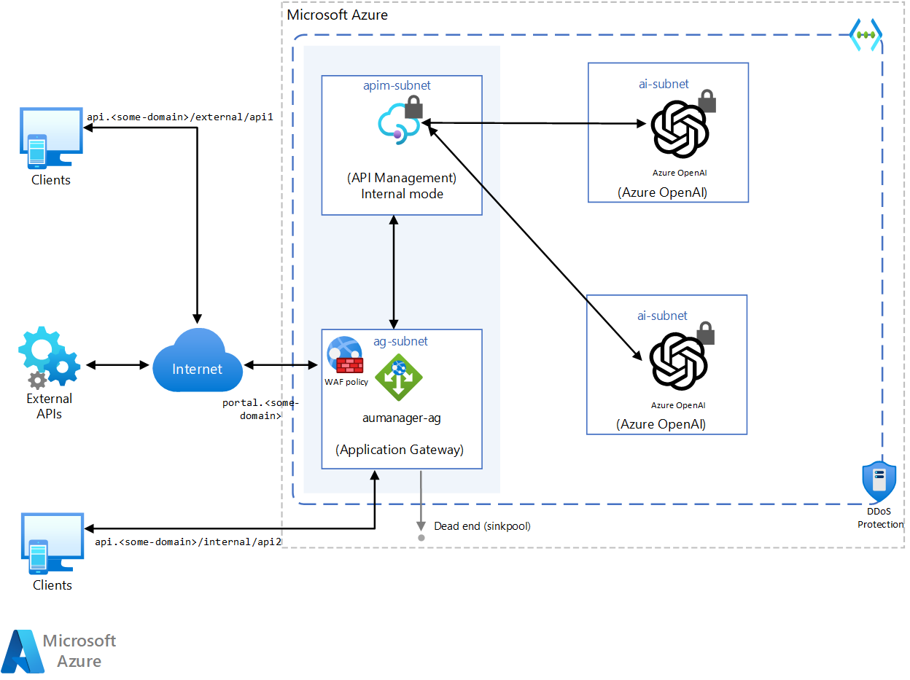

# Protect your APIs with Application Gateway and API Management

API Management is a good means of making generative AI applications both more reliable and scalable. There are now standard policies which are specific to generative AI and these have been packaged as the *GenAI Gateway*. [This](https://github.com/Azure-Samples/AI-Gateway) is a really good resource for understanding how to implement API Management with Azure OpenAI.

For those customers that want to use a web application firewall to additionally protect against the [OWASP top 10](https://owasp.org/www-project-top-ten/) threats, then a web application firewall can also be used in front of API Managment. This pattern is shown [here](https://learn.microsoft.com/en-us/azure/architecture/web-apps/api-management/architectures/protect-apis)

## Overview
Adapting the model for Azure OpenAI, the application gateway is also used with a WAF.

